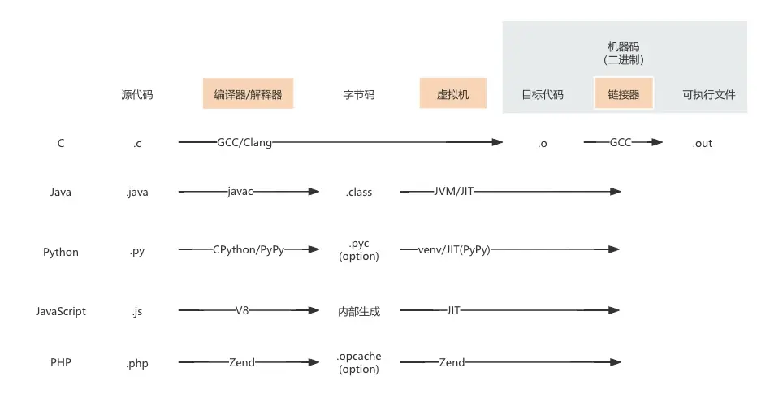

## 解释器与JIT

JIT技术适用于动态语言和跨平台语言，如Java和Python。静态语言则主要依赖编译期优化。

JIT通过对执行代码计数（计数结果保存在内存中，重启进程后归零），获得热点代码，然后将热点代码的机器码缓存，省去每次字节码到机器码的编译过程，从而实现加速的目的。

由于JIT需要统计热点代码，因此这段时间感受不到JIT带来的性能提升。

是否采用JIT，对应了餐厅的两种出餐模式：

- 热门菜品：使用备好的食材快速出餐
- 临时点单：现场准备原材料加工

PHP 7 的 OPcache 是缓存所有代码的字节码，PHP 8 的JIT则是缓存热点代码的机器码，所以 PHP 8 在运行计算密集型任务时性能提升明显。

|            | 设计思想 | 适用场景                                         |
| ---------- | -------- | ------------------------------------------------ |
| Java       |          | 工业                                             |
| Python     |          | 编程入门、算法学习、机器学习、数据分析、网络爬虫 |
| Golang     |          |                                                  |
| Rust       |          |                                                  |
| JavaScript |          |                                                  |
| PHP        |          | Web 页面                                         |

### 包管理工具

|         | 项目依赖                 | 全局安装                        | 临时运行                          | 备注                                                                                                |
| ------- | ------------------------ | ------------------------------- | --------------------------------- | --------------------------------------------------------------------------------------------------- |
| Node.js | `npm install <package>`  | `npm install -g <package>`      | `npx <package>`                   |                                                                                                     |
| Go      | `go get <lib>`           | `go install <tool>@latest`      | `go run <tool>@latest`            |                                                                                                     |
| Rust    | `cargo add <pkg>`        | `cargo install <pkg>`           | 官方未内置（多用第三方工具 crgx） |                                                                                                     |
| Python  | `uv add <package>`       | `uv tool install <package>`     | `uvx <package>`                   | uvx 就是 uv tool run 的快捷别名                                                                     |
| Python  | `pip install <package>`  | `pipx install <package>`        | `pipx run <package>`              | pip 会将工具装在当前激活的虚拟环境或全局；pipx 则会自动为每个工具创建隔离的虚拟环境，防止依赖冲突。 |
| PHP     | `composer require <pkg>` | `composer global require <pkg>` | `composer exec <tool>`            | `composer exec` 仅用于执行本地已安装的工具，PHP 生态目前没有类似 npx 的临时远程下载执行工具。       |

Go 和 Rust是编译型语言，`go install` 和 `cargo install` 编译出来的是无外部依赖的静态二进制文件，它们运行不依赖系统中的其他库版本，因此天然不会发生依赖冲突。

### Python

- `sort()` 用于临时排序
- `sorted()` 用于永久排序
- `enumerate()` 用于遍历 k-v 时
- `zip()` 用于把元素组成为新的 tuple

推导式
装饰器
生成器与迭代器

#### 格式化输出

Python的格式化输出非常简便，只需要在字符串前用 `r` 或 `f` 来表示输出方式

- raw 输出，如 `str = r'I\'m a great coder!'`
- format 输出，把要输出的变量在字符串中用`{}`包裹，如 `f"Hello, {full_name.title()}!"`
  - `-` 左对齐
  - `+` 输出数字带±号
  - `0` 宽度不足时补0
